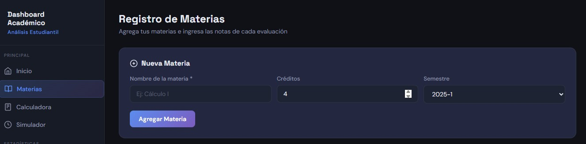
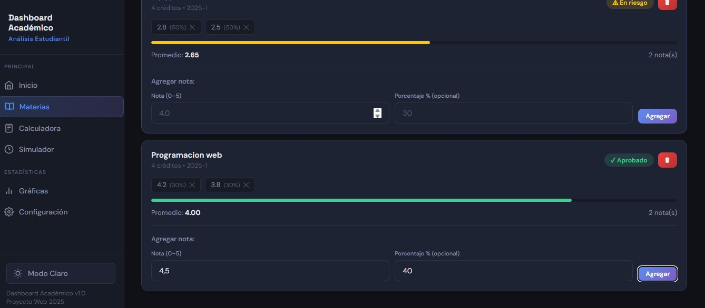
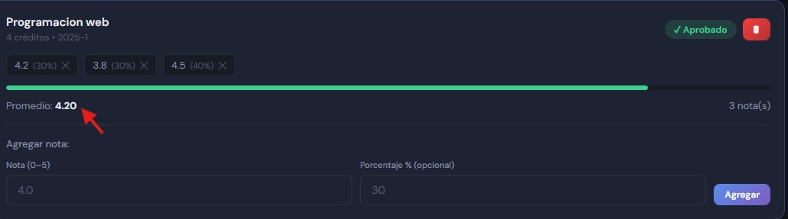
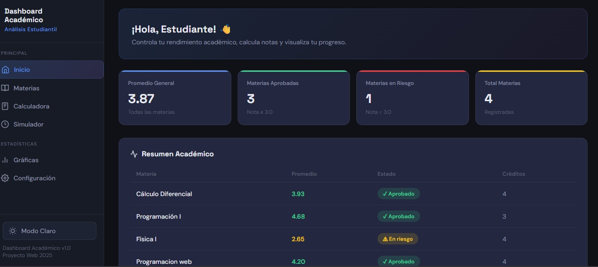
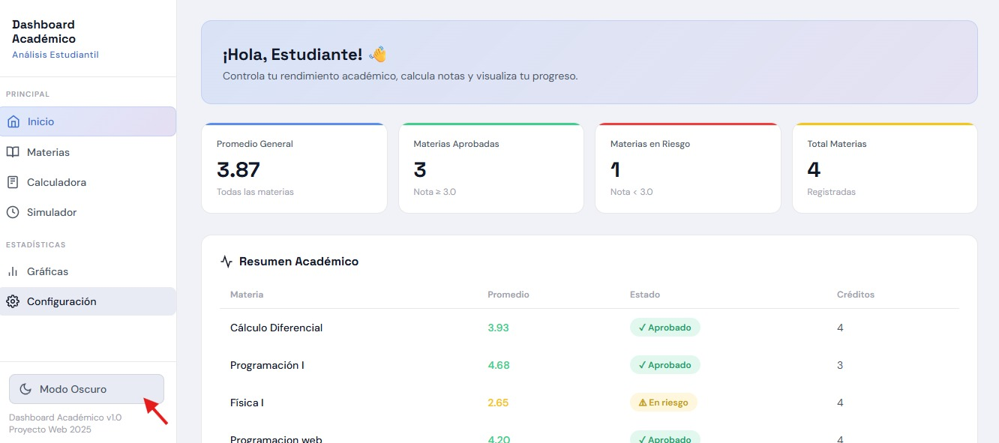
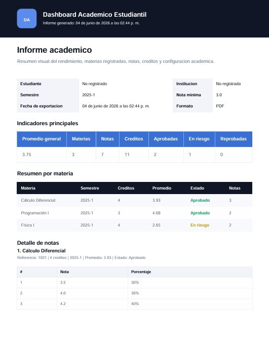
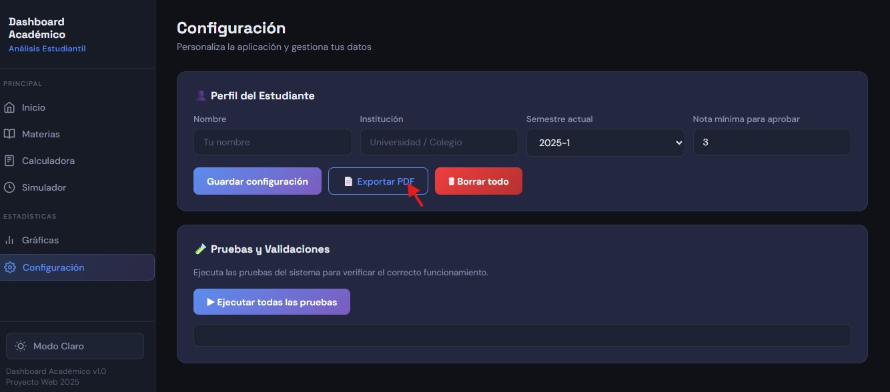
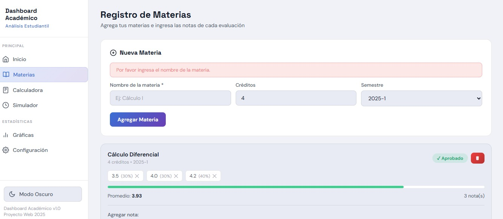
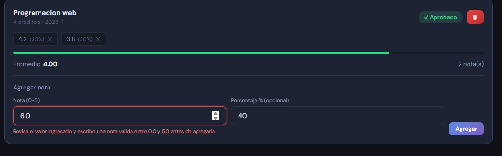
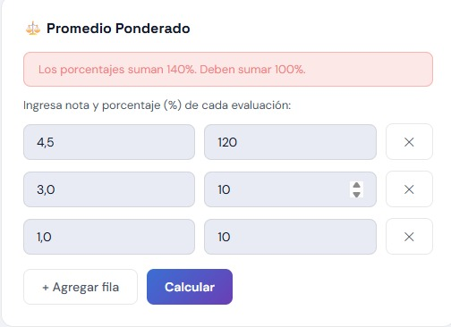

# Informe Técnico
<div align="center">
  
</div>

## Dashboard Inteligente de Análisis Académico Estudiantil

<div align="center">
  
</div>

---

**Autores:** Karen Jhulieth Lucumí Mosquera, Brandon Alfonso Moreno y Juan Camilo Minota Peña  
**Asignatura:** Diseño de Interfaces  
**Programa:** Tecnología en Desarrollo de Software  
**Facultad:** Facultad de Ingeniería  
**Institución:** Universidad del Valle - Sede Norte del Cauca  
**Año:** 2026

<div align="center">
  
</div>

## Tabla de Contenido ##

1. [Problema que soluciona](#1-problema-que-soluciona)
2. [Objetivos del proyecto](#2-objetivos-del-proyecto)
3. [Estructura del sitio web](#3-estructura-del-sitio-web)
4. [Herramientas implementadas](#4-herramientas-implementadas-en-el-dashboard)
5. [Sistema de gráficas y estadísticas](#5-sistema-de-gráficas-y-estadísticas)
6. [Diseño y estilos](#6-diseño-y-estilos)
7. [Funcionalidades con JavaScript](#7-funcionalidades-implementadas-con-javascript)
8. [Accesibilidad y buenas prácticas](#8-accesibilidad-y-buenas-prácticas)
9. [Demostración en vivo](#9-demostración-en-vivo)
10. [Dificultades y soluciones](#10-dificultades-y-soluciones)
11. [Conclusiones](#11-conclusiones)

<div align="center">
  
</div>

## 1. Problema que Soluciona

Muchos estudiantes tienen dificultades para calcular sus notas finales, promedios y rendimiento académico, debido a que las plataformas institucionales no siempre ofrecen herramientas interactivas y visuales para analizar su desempeño.

Además, los estudiantes necesitan saber cuánto deben obtener en un examen final para aprobar una materia y visualizar sus resultados mediante gráficas, estadísticas y paneles fáciles de interpretar.

### Público Objetivo

- Estudiantes de secundaria.
- Estudiantes universitarios.
- Estudiantes que necesiten controlar y mejorar su rendimiento académico.

### ¿Para qué sirve la aplicación?

La aplicación web permite a los estudiantes registrar materias, ingresar calificaciones y calcular automáticamente:

- Nota final.
- Promedio general.
- Promedio ponderado.
- Nota necesaria para aprobar.
- Rendimiento por materia.

También incluye herramientas para visualizar estadísticas académicas mediante gráficas dinámicas y paneles interactivos.

<div align="center">
  
</div>

## 2. Objetivos del Proyecto

### Objetivo General

Desarrollar un dashboard inteligente de análisis académico para estudiantes, que permita registrar, organizar, calcular y visualizar información académica de manera dinámica utilizando tecnologías web como HTML, CSS y JavaScript.

### Objetivos Específicos

1. Diseñar una interfaz moderna, intuitiva y responsiva enfocada en estudiantes.
2. Implementar calculadoras académicas para nota final, promedio y promedio ponderado.
3. Crear un simulador que permita calcular cuánto necesita sacar un estudiante para aprobar una materia.
4. Desarrollar gráficas dinámicas y estadísticas para analizar el rendimiento académico.
5. Permitir la organización de materias y notas por semestre.
6. Incorporar validaciones y modo oscuro/claro para mejorar la experiencia del usuario.

<div align="center">
  
</div>

## 3. Estructura del Sitio Web

La aplicación sigue una estructura semántica HTML5 organizada para mejorar la accesibilidad, la legibilidad del código y el mantenimiento del proyecto.

### Elementos Semánticos Principales

| Elemento | Propósito dentro del proyecto |
| --- | --- |
| `<header>` | Contiene el título principal y el botón para cambiar entre modo oscuro y claro. |
| `<nav>` | Incluye el menú de navegación para acceder a las diferentes secciones. |
| `<main>` | Contiene el contenido principal de la aplicación. |
| `<section>` | Divide el contenido en bloques funcionales como materias, gráficas y calculadoras. |
| `<footer>` | Muestra información final del proyecto. |
<div align="center">
  
</div>

### Ejemplo de Estructura HTML

```html
<header>
  <h1>Dashboard Académico</h1>
  <button id="modo">Modo Oscuro</button>
</header>

<nav>
  <ul>
    <li><a href="#">Inicio</a></li>
    <li><a href="#">Materias</a></li>
    <li><a href="#">Promedios</a></li>
    <li><a href="#">Calculadora Final</a></li>
    <li><a href="#">Gráficas</a></li>
  </ul>
</nav>

<main>
  <section class="calculadora"></section>
  <section class="graficas"></section>
</main>

<footer>
  <p>Proyecto desarrollado en JavaScript</p>
</footer>
```

### Organización de Páginas y Secciones

- Inicio.
- Panel general de estadísticas.
- Materias.
- Calculadora de nota final.
- Calculadora de promedio.
- Calculadora ponderada.
- Simulador académico.
- Sección de gráficas.
- Configuración de tema.

<div align="center">
  
</div>

## 4. Herramientas Implementadas en el Dashboard

### Calculadora de Nota Final

Permite calcular automáticamente cuánto necesita obtener un estudiante en el examen final para aprobar una materia.

### Calculadora de Promedio

Calcula automáticamente:

- Promedio semestral.
- Promedio general.
- Promedio acumulado.

### Calculadora Ponderada

Permite calcular promedios teniendo en cuenta créditos o porcentajes de cada materia.

### Simulador Académico

Permite al estudiante realizar simulaciones como: **“¿Qué pasa si saco 4.5 en el final?”**. El sistema recalcula automáticamente el promedio según el escenario ingresado.

### Panel de Materias

Cada materia cuenta con la siguiente información:

| Dato | Descripción |
| --- | --- |
| Nombre de la materia | Identificación de la asignatura registrada. |
| Notas registradas | Calificaciones ingresadas por el estudiante. |
| Porcentaje de evaluaciones | Peso de cada nota dentro de la materia. |
| Promedio individual | Resultado ponderado de las notas. |
| Estado de aprobación | Indica si la materia está aprobada, en riesgo o reprobada. |

<div align="center">
  
</div>

## 5. Sistema de Gráficas y Estadísticas

La aplicación incluye gráficas dinámicas para analizar el rendimiento académico de forma visual.

### Gráficas Implementadas

| Tipo de gráfica | Función |
| --- | --- |
| Gráfica de barras | Compara el rendimiento entre materias. |
| Gráfica lineal | Muestra la evolución de las notas durante el semestre. |
| Gráfica circular | Visualiza la distribución del promedio académico. |

### Tarjetas Estadísticas

Las tarjetas estadísticas muestran:

- Mejor materia.
- Materia con menor promedio.
- Promedio actual.
- Materias aprobadas.
- Materias en riesgo.

<div align="center">
  
</div>

## 6. Diseño y Estilos

### Tipo de Diseño Implementado

Se implementó un diseño tipo dashboard moderno basado en tarjetas, utilizando **CSS Grid** y **Flexbox** para organizar los componentes de forma ordenada y responsiva.

El diseño modular permite desarrollar cada sección de manera independiente, facilitando el mantenimiento y la escalabilidad del proyecto.

```css
main {
  display: grid;
  grid-template-columns: 1fr 1fr;
  gap: 20px;
}

.card {
  background: white;
  padding: 20px;
  border-radius: 15px;
  box-shadow: 0 4px 10px rgba(0, 0, 0, 0.1);
}
```

### Distribución de la Interfaz

La interfaz está organizada mediante un menú lateral o **sidebar**, que facilita la navegación entre las diferentes secciones del dashboard.

### Diseño Basado en Tarjetas

Las tarjetas permiten separar visualmente la información académica y mejorar la organización del contenido. Algunos ejemplos son:

- Promedio general.
- Nota final.
- Materia actual.
- Alertas académicas.
- Gráficas de rendimiento.

### Uso de Colores

| Color | Propósito |
| --- | --- |
| Azul | Confianza y tecnología. |
| Blanco | Limpieza visual. |
| Gris claro | Organización visual. |
| Verde | Materias aprobadas. |
| Rojo | Alertas o riesgo académico. |
| Gris oscuro | Modo nocturno. |

### Tipografía

Se utiliza una tipografía sans-serif para mejorar la legibilidad y mantener una apariencia moderna.

```css
font-family: Arial, sans-serif;
```

### Espaciado y Modelo de Caja

```css
padding: 20px;
margin: 10px;
border-radius: 15px;
```

### Diseño Responsivo

| Dispositivo | Distribución |
| --- | --- |
| Computador | 2 columnas. |
| Tablet | 1 columna. |
| Celular | Tarjetas apiladas. |

```css
@media (max-width: 768px) {
  main {
    grid-template-columns: 1fr;
  }
}
```

### Experiencia de Usuario

El diseño está enfocado en que el estudiante pueda visualizar rápidamente la información más importante. Las alertas académicas utilizan indicadores visuales por colores:

- Verde: aprobado.
- Amarillo: riesgo.
- Rojo: pérdida de materia.

### Librerías y Herramientas Visuales

- **Bootstrap:** diseño responsivo y componentes visuales.
- **Chart.js:** gráficas dinámicas e interactivas.

<div align="center">
  
</div>

## 7. Funcionalidades Implementadas con JavaScript

### Manipulación del DOM

Se agregan notas y materias dinámicamente al dashboard.

```javascript
const lista = document.getElementById('lista');

function agregarDato(texto) {
  const item = document.createElement('li');
  item.textContent = texto;
  lista.appendChild(item);
}
```

### Eventos

Se utilizan formularios y botones interactivos.

```javascript
boton.addEventListener('click', () => {
  alert('Nota agregada');
});
```

### Calculadora de Promedio

```javascript
function calcularPromedio(notas) {
  const suma = notas.reduce((a, b) => a + b, 0);
  return suma / notas.length;
}
```

### Validaciones

Se valida que los campos no estén vacíos y que las notas se encuentren dentro del rango permitido.

```javascript
if (input.value === '') {
  alert('Campo obligatorio');
}
```

<div align="center">
  
</div>

## 8. Accesibilidad y Buenas Prácticas

El Dashboard Académico Estudiantil fue desarrollado teniendo en cuenta principios de accesibilidad web y buenas prácticas del desarrollo frontend moderno.

### 8.1 Etiquetas Semánticas HTML
La estructura del HTML utiliza etiquetas semánticas para mejorar la accesibilidad y la comprensión del contenido por parte de los usuarios y motores de búsqueda.


| Etiqueta | Uso en el proyecto |
| --- | --- |
| `<header>` | Contiene el título principal y el botón de alternancia de tema. |
| `<nav>` | Barra lateral de navegación con enlaces a cada sección funcional. |
| `<main>` | Área principal donde se renderizan las secciones activas. |
| `<section>` | Delimita cada módulo: Inicio, Materias, Gráficas, entre otros. |
| `<footer>` | Pie de página con información del proyecto y versión de la aplicación. |
| `<form>` | Formularios de entrada de datos con campos y botones asociados. |
| `<button>` | Acciones interactivas implementadas con un elemento nativo. |

### 8.2 Atributos ALT y ARIA

- Los íconos utilizados en la interfaz incluyen `aria-label` para lectores de pantalla.
- Las gráficas generadas con Chart.js incluyen `aria-label` y `role="img"` en el elemento `<canvas>`.
- El botón de alternancia de tema incluye texto que describe su estado actual.

### 8.3 Labels en Formularios

| Campo | Implementación de label |
| --- | --- |
| Nombre de materia | `<label for="mat-nombre">` asociado a `<input id="mat-nombre">`. |
| Créditos | `<label for="mat-creditos">` con indicación del rango válido. |
| Semestre | `<label for="mat-semestre">` con placeholder descriptivo. |
| Valor de nota | `<label for="nota-valor">` con indicación del rango de 0.0 a 5.0. |
| Porcentaje | `<label for="nota-porc">` con indicación de que debe sumar 100%. |

### 8.4 Contraste y Legibilidad

El sistema de diseño fue construido con variables CSS personalizadas que garantizan un contraste adecuado entre texto y fondo, cumpliendo con los estándares de accesibilidad WCAG AA.
| Elemento | Combinación de colores | Resultado |
| --- | --- | --- |
| Texto principal sobre fondo oscuro | `#E8EAF2` sobre `#0F1117` | Ratio aproximado: 12:1. |
| Texto principal sobre fondo claro | `#111827` sobre `#F0F2F8` | Ratio aproximado: 14:1. |
| Texto de énfasis | `#5B8DEE` sobre fondo oscuro | Ratio aproximado: 4.8:1. |
| Texto en tarjetas claras | `#1A1A2E` sobre `#FFFFFF` | Ratio aproximado: 16:1. |
| Alertas de error | `#FFFFFF` sobre `#E53E3E` | Ratio aproximado: 5.7:1. |
| Alertas de éxito | `#FFFFFF` sobre `#2F855A` | Ratio aproximado: 4.9:1. |

### 8.5 Código Ordenado

- Separación de responsabilidades: HTML para estructura, CSS para presentación y JavaScript para comportamiento.
- Variables CSS centralizadas en `:root`.
- Funciones auxiliares reutilizables como `calcProm()`, `estadoMateria()`, `showAlert()` y `guardarStorage()`.
- Objeto de estado centralizado como fuente única de verdad.
- Comentarios descriptivos en funciones y bloques lógicos importantes.

### 8.6 Buenas Prácticas: Nombres Claros

| Identificador | Justificación del nombre |
| --- | --- |
| `agregarMateria()` | Verbo + sustantivo en camelCase; describe exactamente la acción. |
| `calcularNecesaria()` | Indica que calcula la nota necesaria para aprobar. |
| `renderMaterias()` | El prefijo `render` indica que actualiza el DOM. |
| `guardarStorage()` | Diferencia claramente escritura y lectura de datos. |
| `state.materias` | Sustantivo plural dentro del objeto de estado global. |
| `page-materias` | El prefijo `page-` facilita la selección por CSS y JavaScript. |
| `mat-nombre`, `nota-valor` | Prefijos de contexto para campos de formulario. |

### 8.7 Navegación por Teclado

- Todos los enlaces y botones son elementos nativos accesibles con Tab y Enter.
- El indicador de foco visible se mantiene y se personaliza con `outline`.
- La navegación entre secciones sigue el orden lógico del documento HTML.
- Los formularios pueden completarse sin necesidad de ratón.

<div align="center">
  
</div>

## 9. Demostración en Vivo

La demostración en vivo constituye el punto central de la evaluación del proyecto. A continuación se presenta el guion de navegación y las funcionalidades clave a ejecutar.

### 9.1 Guion de Navegación Completa

| Sección | Acciones a demostrar |
| --- | --- |
| Inicio | Mostrar estadísticas generales: promedio global, materias aprobadas, en riesgo y reprobadas. |
| Materias | Registrar una materia, agregar notas con porcentajes y observar el promedio ponderado. |
| Calculadoras | Calcular la nota mínima requerida para aprobar. |
| Simulador | Generar escenarios con notas hipotéticas entre 1.0 y 5.0. |
| Gráficas | Visualizar gráficas de barras, circular y lineal con Chart.js. |
| Configuración | Cambiar nombre, institución y nota mínima aprobatoria. |
| Pruebas del sistema | Ejecutar la suite de pruebas internas y mostrar los resultados. |

### 9.2 Funcionalidades Clave

#### Funcionalidad 1: Registro y Cálculo de Promedio Ponderado

<div align="center">
  
</div>


<div align="center">
  
</div>


<div align="center">
  
</div>


<div align="center">
  
</div>


Caso de prueba:

- Agregar materia **Programación Web** con **4 créditos**.
- Ingresar nota **4.2** con **30%**.
- Ingresar nota **3.8** con **30%**.
- Ingresar nota **4.5** con **40%**.
- Verificar que el promedio ponderado calculado sea **4.17**.

Cálculo:

```text
(4.2 × 0.30) + (3.8 × 0.30) + (4.5 × 0.40) = 4.17
```

#### Funcionalidad 2: Modo Oscuro / Claro

- Hacer clic en el botón de alternancia de tema.
- Verificar que toda la interfaz cambia instantáneamente sin recargar la página.
- Confirmar que la preferencia se guarda en `localStorage` y persiste al refrescar.


<div align="center">
  
</div>


<div align="center">
  
</div>

#### Funcionalidad 3: Persistencia con localStorage

- Demostrar que los datos sobreviven al cerrar y reabrir el navegador.
- Exportar los datos mediante el botón correspondiente.
- Mostrar el contenido del archivo exportado.


<div align="center">
  
</div>

#### Funcionalidad 4: Validaciones en Tiempo Real

- Intentar agregar una materia sin nombre y verificar el mensaje de error.
- Intentar ingresar una nota de **6.0** y validar que se rechaza por estar fuera del rango de 0 a 5.
- Intentar calcular un promedio ponderado con porcentajes que no sumen 100%.


<div align="center">
  
</div>


<div align="center">
  
</div>


<div align="center">
  
</div>

### 9.3 Caso de Uso Real

Sebastián es estudiante de tercer semestre de Ingeniería de Sistemas. Con las evaluaciones finales a dos semanas, necesita saber exactamente qué nota debe obtener en cada examen para aprobar el semestre.

| Materia | Promedio actual | Porcentaje restante | Nota mínima |
| --- | ---: | ---: | ---: |
| Cálculo Diferencial | 2.8 | 40% | 3.0 |
| Programación OO | 3.6 | 30% | 3.0 |
| Bases de Datos | 4.1 | 25% | 3.0 |
| Inglés Técnico | 3.1 | 20% | 3.0 |

Flujo de uso en el dashboard:

1. Sebastián registra sus cuatro materias con las notas parciales ya obtenidas.
2. Navega a la sección **Calculadoras** y usa la opción **Nota necesaria para aprobar**.
3. En Cálculo Diferencial obtiene como resultado que necesita **3.5/5.0** en el examen final.
4. Para Programación OO, el sistema indica que ya aprobó aunque obtenga una nota baja en el final.
5. Activa el simulador para Inglés Técnico y revisa escenarios entre 1.0 y 5.0.
6. Las gráficas muestran que Cálculo Diferencial es su única materia en riesgo real.
7. Exporta sus datos para llevarlos a su próxima sesión de estudio.

<div align="center">
  
</div>

## 10. Dificultades y Soluciones

### 10.1 Problemas Técnicos

| Problema encontrado | Solución aplicada |
| --- | --- |
| Las gráficas de Chart.js no se actualizaban al volver a la sección de gráficas. | Se destruye cada instancia con `chart.destroy()` antes de recrearla. |
| El promedio de materias sin notas generaba `NaN`. | `promedioMateria()` retorna `null` si no hay notas y los cálculos globales filtran esos valores. |
| `localStorage` fallaba silenciosamente en modo incógnito. | `cargarStorage()` y `guardarStorage()` se encapsularon en bloques `try/catch`. |
| Porcentajes que no sumaban 100% producían promedios incorrectos. | Se implementó validación con `Math.abs(totalPorc - 100) > 0.01`. |
| La barra lateral no se cerraba en móviles. | `navTo()` detecta pantallas menores a 768px y retira la clase `sidebar-open`. |
| El simulador mostraba demasiados decimales. | Se aplicó `.toFixed(2)` a los valores numéricos. |

### 10.2 Dificultades de Diseño y UX

| Dificultad | Solución aplicada |
| --- | --- |
| El diseño inicial no era responsivo. | Se implementó un sidebar colapsable y media queries en 768px y 480px. |
| Las tarjetas de materias se desbordaban en pantallas pequeñas. | Se aplicó `overflow-x: auto` en los contenedores de notas. |
| El contraste del tema oscuro era insuficiente. | Se revisaron combinaciones de color hasta cumplir el ratio mínimo WCAG AA. |

### 10.3 Lecciones Aprendidas

- Planificar la arquitectura de estado antes de escribir código evita refactorizaciones costosas.
- Las librerías externas como Chart.js requieren gestión explícita de su ciclo de vida.
- Las validaciones deben implementarse desde el inicio del proyecto.
- `localStorage` es útil para prototipos, pero una aplicación real requiere una base de datos más robusta.

<div align="center">
  
</div>

## 11. Conclusiones

El desarrollo del Dashboard Inteligente de Análisis Académico Estudiantil fue una experiencia formativa integral que permitió aplicar conocimientos fundamentales del desarrollo web moderno en un proyecto real y funcional.

### 11.1 Conocimientos Aplicados

| Área de conocimiento | Aplicación en el proyecto |
| --- | --- |
| HTML semántico | Estructuración con `header`, `nav`, `main`, `section` y `footer`. |
| CSS moderno | Variables CSS, Grid, Flexbox, diseño responsivo, transiciones y modo oscuro/claro. |
| JavaScript ES6+ | Estado centralizado, funciones reutilizables, métodos como `map`, `filter` y `reduce`. |
| Persistencia de datos | Uso de `localStorage`, serialización con JSON y exportación de datos. |
| Librerías externas | Integración de Chart.js desde CDN y gestión de gráficas. |
| Buenas prácticas | Nombres claros, validaciones, manejo de errores, documentación y pruebas. |

### 11.2 ¿Qué Mejoraríamos?

- Refactorizar el código hacia una arquitectura basada en componentes.
- Realizar una auditoría completa de accesibilidad con Lighthouse o axe DevTools.
- Implementar una gestión de estado más robusta.
- Agregar pruebas automatizadas con Jest o Vitest.
- Mejorar la jerarquía visual con apoyo de diseño UX/UI.

### 11.3 ¿Qué Agregaríamos en el Futuro?

- Backend y autenticación con Node.js, Express o Firebase.
- Historial académico multiperiodo.
- Alertas y notificaciones por correo o push.
- Integración con plataformas institucionales como Moodle o Banner.
- Aplicación móvil con React Native o Capacitor.
- Análisis predictivo con modelos simples de Machine Learning.

<div align="center">
  
</div>

## Cierre

Este proyecto demuestra cómo una aplicación web puede convertirse en una herramienta práctica para la toma de decisiones académicas. Al combinar cálculos automáticos, visualización de datos, accesibilidad y diseño responsivo, el dashboard ayuda a los estudiantes a comprender mejor su rendimiento y planificar sus acciones para mejorar.
<div align="center">
  
</div>
